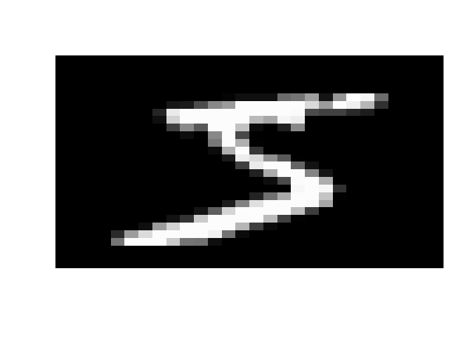
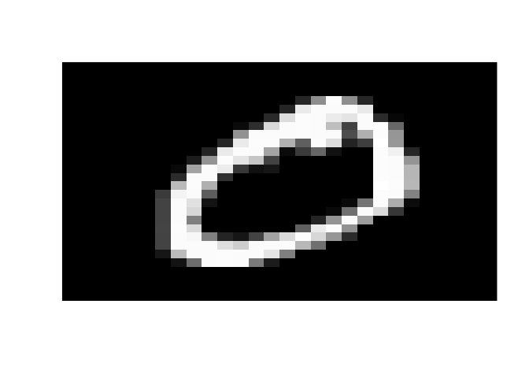
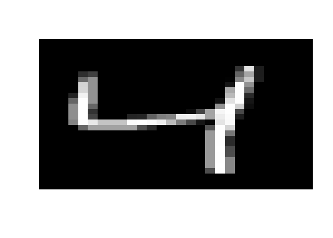
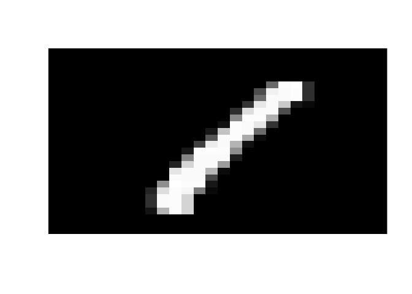
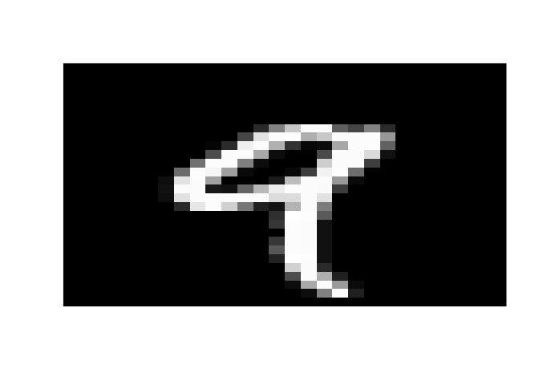
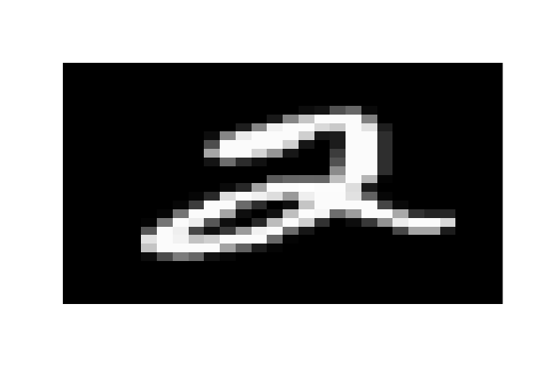
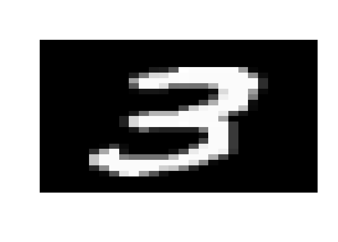
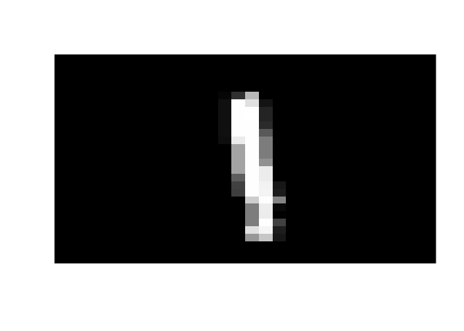
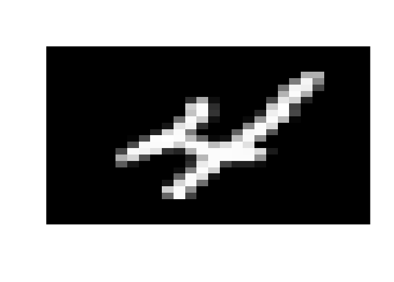

# Clustering MNIST


```r
mnist <- read.csv("mnist_train.csv")
```


```r
ncol(mnist)
```

```
## [1] 785
```


```r
nrow(mnist)
```

```
## [1] 60000
```


```r
colnames(mnist)
```

```
##   [1] "label"  "X1x1"   "X1x2"   "X1x3"   "X1x4"   "X1x5"   "X1x6"  
##   [8] "X1x7"   "X1x8"   "X1x9"   "X1x10"  "X1x11"  "X1x12"  "X1x13" 
##  [15] "X1x14"  "X1x15"  "X1x16"  "X1x17"  "X1x18"  "X1x19"  "X1x20" 
##  [22] "X1x21"  "X1x22"  "X1x23"  "X1x24"  "X1x25"  "X1x26"  "X1x27" 
##  [29] "X1x28"  "X2x1"   "X2x2"   "X2x3"   "X2x4"   "X2x5"   "X2x6"  
##  [36] "X2x7"   "X2x8"   "X2x9"   "X2x10"  "X2x11"  "X2x12"  "X2x13" 
##  [43] "X2x14"  "X2x15"  "X2x16"  "X2x17"  "X2x18"  "X2x19"  "X2x20" 
##  [50] "X2x21"  "X2x22"  "X2x23"  "X2x24"  "X2x25"  "X2x26"  "X2x27" 
##  [57] "X2x28"  "X3x1"   "X3x2"   "X3x3"   "X3x4"   "X3x5"   "X3x6"  
##  [64] "X3x7"   "X3x8"   "X3x9"   "X3x10"  "X3x11"  "X3x12"  "X3x13" 
##  [71] "X3x14"  "X3x15"  "X3x16"  "X3x17"  "X3x18"  "X3x19"  "X3x20" 
##  [78] "X3x21"  "X3x22"  "X3x23"  "X3x24"  "X3x25"  "X3x26"  "X3x27" 
##  [85] "X3x28"  "X4x1"   "X4x2"   "X4x3"   "X4x4"   "X4x5"   "X4x6"  
##  [92] "X4x7"   "X4x8"   "X4x9"   "X4x10"  "X4x11"  "X4x12"  "X4x13" 
##  [99] "X4x14"  "X4x15"  "X4x16"  "X4x17"  "X4x18"  "X4x19"  "X4x20" 
## [106] "X4x21"  "X4x22"  "X4x23"  "X4x24"  "X4x25"  "X4x26"  "X4x27" 
## [113] "X4x28"  "X5x1"   "X5x2"   "X5x3"   "X5x4"   "X5x5"   "X5x6"  
## [120] "X5x7"   "X5x8"   "X5x9"   "X5x10"  "X5x11"  "X5x12"  "X5x13" 
## [127] "X5x14"  "X5x15"  "X5x16"  "X5x17"  "X5x18"  "X5x19"  "X5x20" 
## [134] "X5x21"  "X5x22"  "X5x23"  "X5x24"  "X5x25"  "X5x26"  "X5x27" 
## [141] "X5x28"  "X6x1"   "X6x2"   "X6x3"   "X6x4"   "X6x5"   "X6x6"  
## [148] "X6x7"   "X6x8"   "X6x9"   "X6x10"  "X6x11"  "X6x12"  "X6x13" 
## [155] "X6x14"  "X6x15"  "X6x16"  "X6x17"  "X6x18"  "X6x19"  "X6x20" 
## [162] "X6x21"  "X6x22"  "X6x23"  "X6x24"  "X6x25"  "X6x26"  "X6x27" 
## [169] "X6x28"  "X7x1"   "X7x2"   "X7x3"   "X7x4"   "X7x5"   "X7x6"  
## [176] "X7x7"   "X7x8"   "X7x9"   "X7x10"  "X7x11"  "X7x12"  "X7x13" 
## [183] "X7x14"  "X7x15"  "X7x16"  "X7x17"  "X7x18"  "X7x19"  "X7x20" 
## [190] "X7x21"  "X7x22"  "X7x23"  "X7x24"  "X7x25"  "X7x26"  "X7x27" 
## [197] "X7x28"  "X8x1"   "X8x2"   "X8x3"   "X8x4"   "X8x5"   "X8x6"  
## [204] "X8x7"   "X8x8"   "X8x9"   "X8x10"  "X8x11"  "X8x12"  "X8x13" 
## [211] "X8x14"  "X8x15"  "X8x16"  "X8x17"  "X8x18"  "X8x19"  "X8x20" 
## [218] "X8x21"  "X8x22"  "X8x23"  "X8x24"  "X8x25"  "X8x26"  "X8x27" 
## [225] "X8x28"  "X9x1"   "X9x2"   "X9x3"   "X9x4"   "X9x5"   "X9x6"  
## [232] "X9x7"   "X9x8"   "X9x9"   "X9x10"  "X9x11"  "X9x12"  "X9x13" 
## [239] "X9x14"  "X9x15"  "X9x16"  "X9x17"  "X9x18"  "X9x19"  "X9x20" 
## [246] "X9x21"  "X9x22"  "X9x23"  "X9x24"  "X9x25"  "X9x26"  "X9x27" 
## [253] "X9x28"  "X10x1"  "X10x2"  "X10x3"  "X10x4"  "X10x5"  "X10x6" 
## [260] "X10x7"  "X10x8"  "X10x9"  "X10x10" "X10x11" "X10x12" "X10x13"
## [267] "X10x14" "X10x15" "X10x16" "X10x17" "X10x18" "X10x19" "X10x20"
## [274] "X10x21" "X10x22" "X10x23" "X10x24" "X10x25" "X10x26" "X10x27"
## [281] "X10x28" "X11x1"  "X11x2"  "X11x3"  "X11x4"  "X11x5"  "X11x6" 
## [288] "X11x7"  "X11x8"  "X11x9"  "X11x10" "X11x11" "X11x12" "X11x13"
## [295] "X11x14" "X11x15" "X11x16" "X11x17" "X11x18" "X11x19" "X11x20"
## [302] "X11x21" "X11x22" "X11x23" "X11x24" "X11x25" "X11x26" "X11x27"
## [309] "X11x28" "X12x1"  "X12x2"  "X12x3"  "X12x4"  "X12x5"  "X12x6" 
## [316] "X12x7"  "X12x8"  "X12x9"  "X12x10" "X12x11" "X12x12" "X12x13"
## [323] "X12x14" "X12x15" "X12x16" "X12x17" "X12x18" "X12x19" "X12x20"
## [330] "X12x21" "X12x22" "X12x23" "X12x24" "X12x25" "X12x26" "X12x27"
## [337] "X12x28" "X13x1"  "X13x2"  "X13x3"  "X13x4"  "X13x5"  "X13x6" 
## [344] "X13x7"  "X13x8"  "X13x9"  "X13x10" "X13x11" "X13x12" "X13x13"
## [351] "X13x14" "X13x15" "X13x16" "X13x17" "X13x18" "X13x19" "X13x20"
## [358] "X13x21" "X13x22" "X13x23" "X13x24" "X13x25" "X13x26" "X13x27"
## [365] "X13x28" "X14x1"  "X14x2"  "X14x3"  "X14x4"  "X14x5"  "X14x6" 
## [372] "X14x7"  "X14x8"  "X14x9"  "X14x10" "X14x11" "X14x12" "X14x13"
## [379] "X14x14" "X14x15" "X14x16" "X14x17" "X14x18" "X14x19" "X14x20"
## [386] "X14x21" "X14x22" "X14x23" "X14x24" "X14x25" "X14x26" "X14x27"
## [393] "X14x28" "X15x1"  "X15x2"  "X15x3"  "X15x4"  "X15x5"  "X15x6" 
## [400] "X15x7"  "X15x8"  "X15x9"  "X15x10" "X15x11" "X15x12" "X15x13"
## [407] "X15x14" "X15x15" "X15x16" "X15x17" "X15x18" "X15x19" "X15x20"
## [414] "X15x21" "X15x22" "X15x23" "X15x24" "X15x25" "X15x26" "X15x27"
## [421] "X15x28" "X16x1"  "X16x2"  "X16x3"  "X16x4"  "X16x5"  "X16x6" 
## [428] "X16x7"  "X16x8"  "X16x9"  "X16x10" "X16x11" "X16x12" "X16x13"
## [435] "X16x14" "X16x15" "X16x16" "X16x17" "X16x18" "X16x19" "X16x20"
## [442] "X16x21" "X16x22" "X16x23" "X16x24" "X16x25" "X16x26" "X16x27"
## [449] "X16x28" "X17x1"  "X17x2"  "X17x3"  "X17x4"  "X17x5"  "X17x6" 
## [456] "X17x7"  "X17x8"  "X17x9"  "X17x10" "X17x11" "X17x12" "X17x13"
## [463] "X17x14" "X17x15" "X17x16" "X17x17" "X17x18" "X17x19" "X17x20"
## [470] "X17x21" "X17x22" "X17x23" "X17x24" "X17x25" "X17x26" "X17x27"
## [477] "X17x28" "X18x1"  "X18x2"  "X18x3"  "X18x4"  "X18x5"  "X18x6" 
## [484] "X18x7"  "X18x8"  "X18x9"  "X18x10" "X18x11" "X18x12" "X18x13"
## [491] "X18x14" "X18x15" "X18x16" "X18x17" "X18x18" "X18x19" "X18x20"
## [498] "X18x21" "X18x22" "X18x23" "X18x24" "X18x25" "X18x26" "X18x27"
## [505] "X18x28" "X19x1"  "X19x2"  "X19x3"  "X19x4"  "X19x5"  "X19x6" 
## [512] "X19x7"  "X19x8"  "X19x9"  "X19x10" "X19x11" "X19x12" "X19x13"
## [519] "X19x14" "X19x15" "X19x16" "X19x17" "X19x18" "X19x19" "X19x20"
## [526] "X19x21" "X19x22" "X19x23" "X19x24" "X19x25" "X19x26" "X19x27"
## [533] "X19x28" "X20x1"  "X20x2"  "X20x3"  "X20x4"  "X20x5"  "X20x6" 
## [540] "X20x7"  "X20x8"  "X20x9"  "X20x10" "X20x11" "X20x12" "X20x13"
## [547] "X20x14" "X20x15" "X20x16" "X20x17" "X20x18" "X20x19" "X20x20"
## [554] "X20x21" "X20x22" "X20x23" "X20x24" "X20x25" "X20x26" "X20x27"
## [561] "X20x28" "X21x1"  "X21x2"  "X21x3"  "X21x4"  "X21x5"  "X21x6" 
## [568] "X21x7"  "X21x8"  "X21x9"  "X21x10" "X21x11" "X21x12" "X21x13"
## [575] "X21x14" "X21x15" "X21x16" "X21x17" "X21x18" "X21x19" "X21x20"
## [582] "X21x21" "X21x22" "X21x23" "X21x24" "X21x25" "X21x26" "X21x27"
## [589] "X21x28" "X22x1"  "X22x2"  "X22x3"  "X22x4"  "X22x5"  "X22x6" 
## [596] "X22x7"  "X22x8"  "X22x9"  "X22x10" "X22x11" "X22x12" "X22x13"
## [603] "X22x14" "X22x15" "X22x16" "X22x17" "X22x18" "X22x19" "X22x20"
## [610] "X22x21" "X22x22" "X22x23" "X22x24" "X22x25" "X22x26" "X22x27"
## [617] "X22x28" "X23x1"  "X23x2"  "X23x3"  "X23x4"  "X23x5"  "X23x6" 
## [624] "X23x7"  "X23x8"  "X23x9"  "X23x10" "X23x11" "X23x12" "X23x13"
## [631] "X23x14" "X23x15" "X23x16" "X23x17" "X23x18" "X23x19" "X23x20"
## [638] "X23x21" "X23x22" "X23x23" "X23x24" "X23x25" "X23x26" "X23x27"
## [645] "X23x28" "X24x1"  "X24x2"  "X24x3"  "X24x4"  "X24x5"  "X24x6" 
## [652] "X24x7"  "X24x8"  "X24x9"  "X24x10" "X24x11" "X24x12" "X24x13"
## [659] "X24x14" "X24x15" "X24x16" "X24x17" "X24x18" "X24x19" "X24x20"
## [666] "X24x21" "X24x22" "X24x23" "X24x24" "X24x25" "X24x26" "X24x27"
## [673] "X24x28" "X25x1"  "X25x2"  "X25x3"  "X25x4"  "X25x5"  "X25x6" 
## [680] "X25x7"  "X25x8"  "X25x9"  "X25x10" "X25x11" "X25x12" "X25x13"
## [687] "X25x14" "X25x15" "X25x16" "X25x17" "X25x18" "X25x19" "X25x20"
## [694] "X25x21" "X25x22" "X25x23" "X25x24" "X25x25" "X25x26" "X25x27"
## [701] "X25x28" "X26x1"  "X26x2"  "X26x3"  "X26x4"  "X26x5"  "X26x6" 
## [708] "X26x7"  "X26x8"  "X26x9"  "X26x10" "X26x11" "X26x12" "X26x13"
## [715] "X26x14" "X26x15" "X26x16" "X26x17" "X26x18" "X26x19" "X26x20"
## [722] "X26x21" "X26x22" "X26x23" "X26x24" "X26x25" "X26x26" "X26x27"
## [729] "X26x28" "X27x1"  "X27x2"  "X27x3"  "X27x4"  "X27x5"  "X27x6" 
## [736] "X27x7"  "X27x8"  "X27x9"  "X27x10" "X27x11" "X27x12" "X27x13"
## [743] "X27x14" "X27x15" "X27x16" "X27x17" "X27x18" "X27x19" "X27x20"
## [750] "X27x21" "X27x22" "X27x23" "X27x24" "X27x25" "X27x26" "X27x27"
## [757] "X27x28" "X28x1"  "X28x2"  "X28x3"  "X28x4"  "X28x5"  "X28x6" 
## [764] "X28x7"  "X28x8"  "X28x9"  "X28x10" "X28x11" "X28x12" "X28x13"
## [771] "X28x14" "X28x15" "X28x16" "X28x17" "X28x18" "X28x19" "X28x20"
## [778] "X28x21" "X28x22" "X28x23" "X28x24" "X28x25" "X28x26" "X28x27"
## [785] "X28x28"
```

Dataset contains 28X28 pixels of images and a label column

Representation of a image


```r
visualize_image <- function(input){
  temp <- matrix(as.numeric(input), 28, 28)
  temp <- temp[,ncol(temp):1]
  return( image(temp, axes = FALSE, col=gray((0:255)/255),useRaster = T))
}
```


```r
apply(mnist[1:10,-1],1,visualize_image)
```

<!-- --><!-- --><!-- --><!-- --><!-- --><!-- --><!-- --><!-- --><!-- --><!-- -->

```
## NULL
```

Label for the above image

```r
mnist[1,1]
```

```
## [1] 5
```


```r
mnist_1n8 <- mnist[mnist[1]==1 | mnist[1]==8,]
```

12593 observations of 785 variables

For clustering, we remove the label attribute


```r
mnist_1n8_nolabel <- mnist_1n8[,-1]
```

784 observations (pixels : 28x28)


```r
clus <- kmeans(mnist_1n8_nolabel, centers = 2, iter.max = 50, nstart = 50)
```


```r
head(clus$cluster)
```

```
##  4  7  9 15 18 24 
##  1  1  1  1  2  1
```

Changing the cluster label 2 to 8 and attaching to actual data


```r
mnist_1n8$clabel <- clus$cluster
mnist_1n8$clabel[mnist_1n8$clabel==2] <- 8
```


```r
summary(as.factor(mnist_1n8$label))
```

```
##    1    8 
## 6742 5851
```


```r
summary(as.factor(mnist_1n8$clabel))
```

```
##    1    8 
## 7164 5429
```

